  

  <h1 align="center"><b>Hello there, I'm Ayush 👋</b></h1>

&nbsp;

 

### I am a grad student at MTSU
- 🔭 I’m currently working on my Portfolio Website :grin:
- 🌱 I’m currently learning about the Analysis of Algorithms
- 📬 How to reach me: [Let's get in touch!](https://www.linkedin.com/in/-ayush-kamath/)

 

### 🚀 What I Do

- 💻 Build full-stack applications with **React, TypeScript, Node.js, Python, and SQL**
- 🤖 Develop AI-powered applications using the **OpenAI and Google Gemini APIs**
- ☁️ Build and deploy cloud solutions using **AWS (EC2, S3, Lambda)**
- 🧠 Studying **algorithms, data structures, software design, and parallel processing**
- 🛠️ Use modern developer tooling including **Docker, Git, Cursor, and GitHub Copilot**
- 🔬 Apply data analysis and machine learning techniques to large datasets
- 👨‍🏫 Teach Python while helping 100+ students develop strong programming fundamentals

### 🏆 Highlights

- 🎓 **HackMT '26 Scholarship Recipient** — selected as 1 of 2 recipients among 120+ participants
- 🏅 **Hackers' Choice Award — HackMT 2025**
- 🥇 **1st Place — HackMT 2024**
- 👥 **Former President of MTSU ACM**, growing active membership by 50+ students
- 🎤 Organized technical panels featuring engineering leaders from **CGI, Caterpillar, and Asurion** for 120+ attendees
- 📊 Built Python data pipelines processing **10,000+ vulnerability records** as Web3 Security Data Analyst Extern.
- 🎓 **Learning Assistant — MTSU:** Supported **80+ students** through problem-solving and coursework for a biology course.
- 📈 **Social Media Specialist — MTSU:** Increased Instagram views **611%** and engagement **267%** through data-driven optimization.
- 🏆 **Honors Certificate:** Received recognition from MTSU University Honors College for completing 18+ hours of honors category courses.

 

### Languages and Tools:

 

### ⚡ GitHub Stats

  

